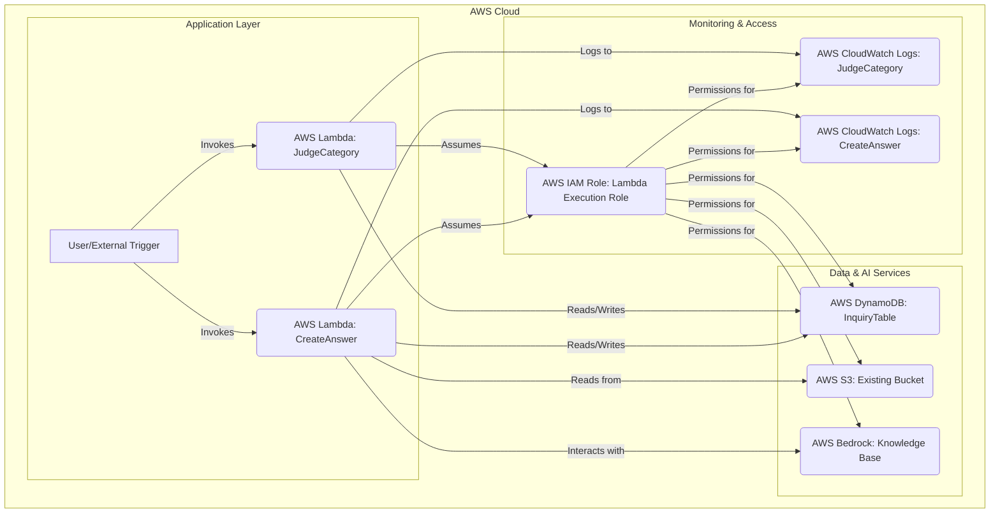

```mermaid
graph TD
    subgraph "AWS Cloud"
        subgraph "Application Layer"
            User[User/External Trigger] -->|Invokes| Lambda_JudgeCategory
            User -->|Invokes| Lambda_CreateAnswer
            Lambda_JudgeCategory(AWS Lambda: JudgeCategory)
            Lambda_CreateAnswer(AWS Lambda: CreateAnswer)
        end

        subgraph "Data & AI Services"
            DynamoDB(AWS DynamoDB: InquiryTable)
            S3(AWS S3: Existing Bucket)
            BedrockKB(AWS Bedrock: Knowledge Base)
        end

        subgraph "Monitoring & Access"
            CloudWatch_JudgeCategory(AWS CloudWatch Logs: JudgeCategory)
            CloudWatch_CreateAnswer(AWS CloudWatch Logs: CreateAnswer)
            IAM_Role(AWS IAM Role: Lambda Execution Role)
        end

        Lambda_JudgeCategory -->|Reads/Writes| DynamoDB
        Lambda_JudgeCategory -->|Logs to| CloudWatch_JudgeCategory

        Lambda_CreateAnswer -->|Reads/Writes| DynamoDB
        Lambda_CreateAnswer -->|Reads from| S3
        Lambda_CreateAnswer -->|Interacts with| BedrockKB
        Lambda_CreateAnswer -->|Logs to| CloudWatch_CreateAnswer

        Lambda_JudgeCategory -- Assumes --> IAM_Role
        Lambda_CreateAnswer -- Assumes --> IAM_Role

        IAM_Role -->|Permissions for| DynamoDB
        IAM_Role -->|Permissions for| S3
        IAM_Role -->|Permissions for| BedrockKB
        IAM_Role -->|Permissions for| CloudWatch_JudgeCategory
        IAM_Role -->|Permissions for| CloudWatch_CreateAnswer
    end
```